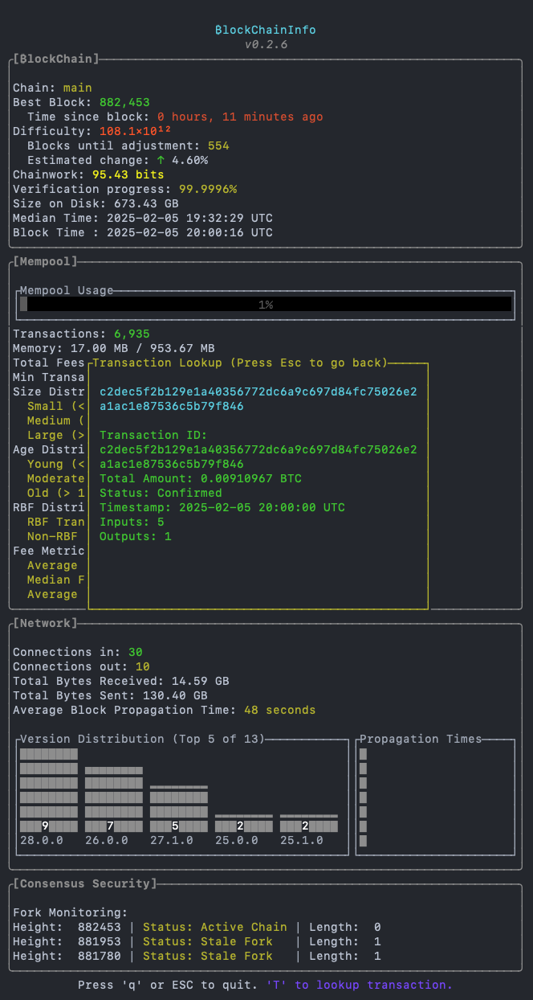

# Blockchaininfo


## Overview

**Blockchaininfo** is a Rust-based application designed to interact with a Bitcoin node via RPC, providing detailed, real-time insights into the blockchain, mempool, and network status. It formats and color-codes output to make complex data more accessible and user-friendly. Recent updates include a block-based alarm clock feature for enhanced functionality.

---

## Features

1. **Blockchain Information**  
   - Details include:
     - Chain
     - Best Block
     - Time since block
     - Difficulty
     - Blocks until adjustment
     - Estimated change
     - Chainwork (in bits)
     - Verification Progress
     - Size on Disk
     - Median and Block Times
     - Time Since Last Block
     - Blocks until adjustment (Added)  

   - Displays **warnings** from the Bitcoin node, if present.

2. **Mempool Information**  
   - Shows:
     - Total Transactions
     - Memory Usage
     - Total Fees
     - Minimum Transaction Fee in vSats/vByte  
   - Color-coded memory usage:
     - **Green**: Below 1/3 of max memory.
     - **Yellow**: Between 1/3 and 2/3 of max memory.
     - **Red**: Above 2/3 of max memory.

3. **Network Information**  
   - Displays:
     - Number of inbound and outbound peer connections.

4. **Block-Based Alarm Clock**  
   - **New Command Line Feature**: `-a18 some_mp3_file_name_and_path` activates and sets the alarm to play the specified MP3 file a certain number of blocks in the future.
   - **Planned Enhancements**:
     - Configurable default snooze duration.
     - Support for more advanced options via a config file.

---

## File Structure

```plaintext
.
├── benches/
│   └── benchmark.rs      # For bench testing.
├── cargo.toml
└── src/
    ├── config.rs         # Configuration loading and validation.
    ├── display/
    │   ├── display_blockchain_info.rs  # Displays blockchain data.
    │   ├── display_mempool_info.rs     # Displays mempool data.
    │   └── display_network_info.rs     # Displays network data.
    ├── display.rs        # Aggregates display modules.
    ├── lib.rs            # For testing.
    ├── main.rs           # Application entry point.
    ├── models/           # Data and error handling modules.
    │   ├── block_info.rs     # Block data model.
    │   ├── blockchain_info.rs  # Blockchain data model and implementations.
    │   ├── mempool_info.rs     # Mempool data model and implementations.
    │   ├── network_info.rs     # Network data model and implementations.
    │   └── errors.rs           # Error handling.
    ├── models.rs         # Aggregates Data and Error modules.
    ├── rpc/              # RPC modules for interacting with the Bitcoin node.
    │   ├── block.rs      # Block data fetching.
    │   ├── blockchain.rs # Blockchain data fetching.
    │   ├── mempool.rs    # Mempool data fetching.
    │   └── network.rs    # Network data fetching.
    ├── rpc.rs            # Aggregates RPC modules.
    ├── utils.rs          # Utility functions (e.g., data formatting).
    ├── alarm.rs          # Implements block-based alarm clock functionality.
```

---

## Requirements

### Configuration

The application requires Bitcoin Core RPC credentials to function properly. These credentials can be provided in one of the following ways:

1. **`config.toml` File (Default)**  
   Create a `config.toml` file in the root directory with the following structure:

   ```toml
   [bitcoin_rpc]
   username = "your_username"
   password = "your_password"
   address = "http://127.0.0.1:8332"
   ```

   Replace the values with your actual Bitcoin Core RPC credentials.

2. **Environment Variables (Alternative)**  
   If `config.toml` is not provided, the application will look for the following environment variables:
   - `RPC_USER`: Your Bitcoin Core RPC username
   - `RPC_PASSWORD`: Your Bitcoin Core RPC password
   - `RPC_ADDRESS`: The Bitcoin Core RPC server address (e.g., `http://127.0.0.1:8332`, `https://your-node.local`)

3. **macOS Keychain (Preferred for macOS)**  
   On macOS, you can securely store the RPC password in the system Keychain. This is the most secure and recommended method. To set it up:
   - Use the following command to add the password to your Keychain:

     ```bash
     security add-generic-password -a bitcoin -s rpc-password -w "your_password"
     ```

   - The program will automatically retrieve the password using the Keychain during runtime. Ensure the username (`RPC_USER`) and address (`RPC_ADDRESS`) are provided either in the `config.toml` file or as environment variables.

4. **Rust (Stable)**  
   - Install Rust via [rustup.rs](https://rustup.rs/).  

---

## Installation

1. Clone the repository:

   ```bash
   git clone https://github.com/TH3BAT/Blockchaininfo.git
   cd Blockchaininfo
   ```

2. Build the project:

   ```bash
   cargo build --release
   ```

---

## Usage

1. Ensure your Bitcoin node is running with RPC enabled.
2. Run the application:

   ```bash
   ./target/release/blockchaininfo
   ```

3. Use the new alarm clock feature to set an alarm based on future blocks:

   ```bash
   ./target/release/blockchaininfo -a18 src/assets/sample.mp3
   ```

---

## Example Output



---

## Error Handling

The program includes robust error handling:

- **Configuration Errors**: Ensures `config.toml` or environment variables contains valid credentials and address.
- **RPC Communication Errors**: Handles failures in connecting to the Bitcoin node.  
- **Data Parsing Errors**: Identifies and reports issues with parsing the JSON response.
- **Alarm Errors**: Validates the MP3 file path and block input for the alarm clock feature.

---

## Contributions

We welcome contributions! To get involved:

1. Fork the repository.
2. Create a feature branch.
3. Open a pull request with a clear description.

---

## License

This project is licensed under the MIT License. See the [LICENSE](LICENSE) file for details.
