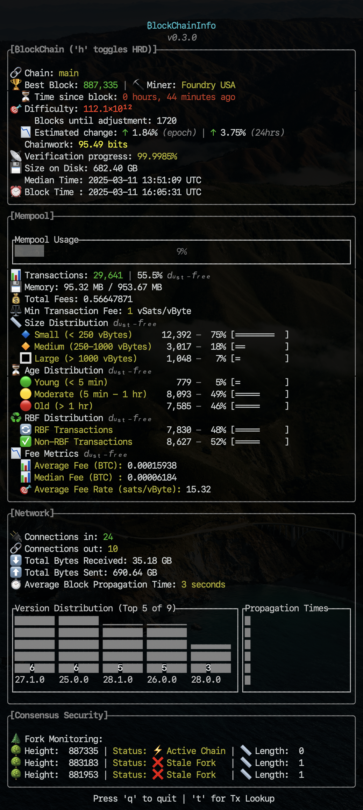

# Blockchaininfo


## Overview

**Blockchaininfo** is your gateway to understanding the **heartbeat of the Bitcoin network**. Built in **Rust** for speed and reliability, this application connects seamlessly to your Bitcoin node via RPC, offering **real-time, detailed insights** into the blockchain, mempool, and overall network health.

### Why Blockchaininfo?

In a world where decentralization and security are paramount, Blockchaininfo is designed to **monitor and showcase the state of Bitcoin's decentralization**, providing actionable insights to ensure the network remains robust and resistant to centralized control. It serves as a vital tool for tracking the **health and integrity of the blockchain**, offering a comprehensive view of node version distribution, network security metrics, and mempool activity.

### Key Features

- **Real-Time Data:** Stay up-to-date with live blockchain and mempool metrics, ensuring you always have the latest pulse of the network.
- **Decentralization Monitoring:** Analyze node version distribution to assess the diversity and resilience of the network.
- **User-Friendly Dashboard:** A **live terminal interface** delivers formatted, color-coded output, making complex data intuitive and actionable.
- **Rust-Powered Efficiency:** Leverage Rust’s performance and reliability for seamless and responsive interaction with your Bitcoin node.

Whether you're a developer, node operator, or Bitcoin enthusiast, Blockchaininfo empowers you with the tools to monitor, analyze, and protect the decentralized future of Bitcoin. 🚀

---

## File Structure

```plaintext
.
├── benches/
│   └── benchmark.rs          # For bench testing.
├── cargo.toml
└── src/
    ├── config.rs             # Configuration loading and validation.
    ├── display/
    │   ├── display_blockchain_info.rs      # Displays blockchain data.
    │   ├── display_mempool_info.rs         # Displays mempool data.
    │   ├── display_network_info.rs         # Displays network data.
    │   ├── display_consensus_security_info.rs  # Displays consensus security data.
    ├── display.rs             # Aggregates display modules.
    ├── lib.rs                 # For testing.
    ├── main.rs                # Application entry point.
    ├── models/                # Data and error handling modules.
    │   ├── block_info.rs           # Block data model.
    │   ├── blockchain_info.rs      # Blockchain data model and implementations.
    │   ├── mempool_info.rs         # Mempool data model and implementations.
    │   ├── network_info.rs         # Network data model.
    │   ├── network_totals.rs       # Network data model (bytes reveived & sent).
    │   ├── peer_info.rs            # Peers data model.
    │   ├── consensus_security.rs   # Consensus security data model.
    │   └── errors.rs               # Error handling.
    ├── models.rs              # Aggregates Data and Error modules.
    ├── rpc/                   # RPC modules for interacting with the Bitcoin node.
    │   ├── block.rs           # Block data fetching.
    │   ├── blockchain.rs      # Blockchain data fetching.
    │   ├── initial_mempool_distro.rs    # Handles initial batch RPC loading.
    │   ├── mempool.rs         # Mempool data fetching.
    │   ├── network.rs         # Network data fetching.
    │   ├── network_peers.rs   # Peers data model.
    │   ├── network_totals.rs  # Network data fetching (bytes reveived & sent).
    │   ├── mempool_distro.rs  # Fetches the sampled tx IDs for distribution metrics.
    │   ├── transaction.rs     # Fetches Transaction for lookup.
    │   └── chain_tips.rs      # Fetches chain tips for consensus monitoring.
    ├── rpc.rs                 # Aggregates RPC modules.
    ├── runapp.rs              # Handles TUI terminal setup and main application flow.
    └── utils.rs               # Utility functions (e.g., data formatting).
```

---

## Requirements

Here’s the updated **README.md** section with the **new configuration logic** (CLI flag & environment variable support). 🔥  

---

### **Configuration**

The application requires Bitcoin Core RPC credentials to function properly. These credentials can be provided in one of the following ways:

---

### **1. Automatic Failsafe Mode (No Setup Required)** 🚀

If **no configuration is found**, the application will **prompt the user** to enter their Bitcoin Core RPC credentials **interactively** and will **automatically generate** a `config.toml` file. This ensures that first-time users can get started **immediately** without manual setup.

- The generated `config.toml` will be saved at:

  ```plaintext
  ./target/release/config.toml 
  ```

- After initial setup, the application will load credentials from this file on future runs.

**You can still override this behavior** using a custom config path (see below).

---

### **2. `config.toml` File (Recommended for Customization)**

If `config.toml` exists, the application will **load credentials from it automatically**.

By default, `blockchaininfo` looks for this file in:

- `./target/release/config.toml` (default location)

You can **specify a custom location** using:

- **CLI flag:** `--config /path/to/config.toml`
- **Environment variable:** `BLOCKCHAININFO_CONFIG=/path/to/config.toml`

#### **Example `config.toml` file:**

```toml
[bitcoin_rpc]
username = "your_username"
password = "your_password"
address = "http://127.0.0.1:8332"
```

Replace the values with your actual Bitcoin Core RPC credentials.

---

### **3. Environment Variables (Alternative Method)**

If `config.toml` is **not found**, and the user **does not enter credentials manually**, the application will look for the following environment variables:

| Variable         | Description |
|-----------------|------------|
| `RPC_USER`      | Your Bitcoin Core RPC username |
| `RPC_PASSWORD`  | Your Bitcoin Core RPC password |
| `RPC_ADDRESS`   | The Bitcoin Core RPC server address (e.g., `http://127.0.0.1:8332`, `https://your-node.local`) |

Set them in your terminal before running:

```bash
export RPC_USER="your_username"
export RPC_PASSWORD="your_password"
export RPC_ADDRESS="http://127.0.0.1:8332"
```

---

### **4. macOS Keychain (Recommended for macOS Security)** 🔒

On macOS, you can securely store the RPC password in the system Keychain. This is the most secure and recommended method. To set it up:

- Add the password to your Keychain:

  ```bash
  security add-generic-password -a bitcoin -s rpc-password -w "your_password"
  ```

- The program will automatically retrieve the password using the Keychain during runtime.  
  **Ensure `RPC_USER` and `RPC_ADDRESS` are set** in either:
  - `config.toml`
  - Environment variables (`RPC_USER`, `RPC_ADDRESS`)

---

### **4. Priority Order (How the App Decides Which Config to Use)**

The application loads configuration in the following order:

1️⃣ **CLI Flag (`--config /path/to/config.toml`)** → **Highest priority**  
2️⃣ **Environment Variable (`BLOCKCHAININFO_CONFIG`)** → If no CLI flag is set  
3️⃣ **Default File Path (`./target/release/config.toml`)** → If no custom path is provided  
4️⃣ **Environment Variables (`RPC_USER`, `RPC_PASSWORD`, `RPC_ADDRESS`)** → If no config file is found  
5️⃣ **macOS Keychain** → If running on macOS & `RPC_PASSWORD` is missing  

🚀 **This ensures maximum flexibility while keeping a secure & seamless setup!**

### **5. Rust (Stable)**

- Install Rust via [rustup.rs](https://rustup.rs/).  

---

## Installation

1. Clone the repository:

   ```bash
   git clone https://github.com/TH3BAT/Blockchaininfo.git
   cd Blockchaininfo
   ```

2. Build the project:

   ```bash
   cargo build --release
   ```

---

## Usage

1. Ensure your Bitcoin node is running with RPC enabled.
2. Run the application:

   ```bash
   ./target/release/blockchaininfo
   ```

---

## Example Output



---

## Error Handling

The program includes robust error handling:

- **Configuration Errors**: Ensures `config.toml` or environment variables contains valid credentials and address.
- **RPC Communication Errors**: Handles failures in connecting to the Bitcoin node.  
- **Data Parsing Errors**: Identifies and reports issues with parsing the JSON response.

---

## Contributions

We welcome contributions! To get involved:

1. Fork the repository.
2. Create a feature branch.
3. Open a pull request with a clear description.

---

## License

This project is licensed under the MIT License. See the [LICENSE](LICENSE) file for details.
